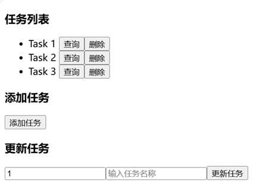
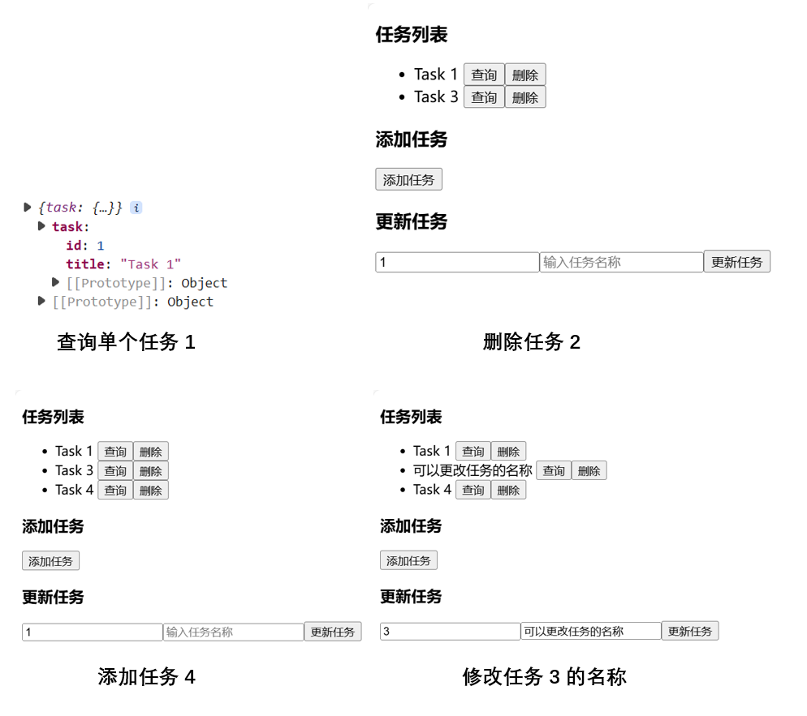
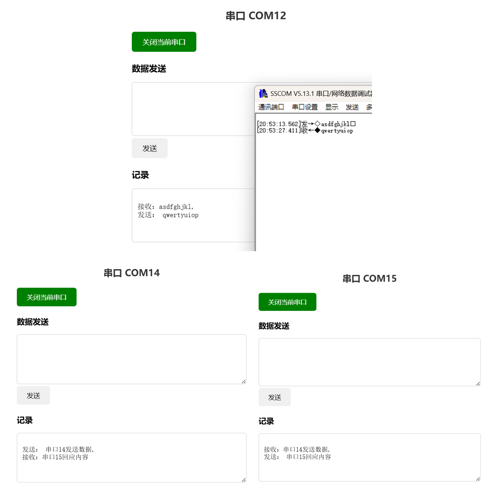
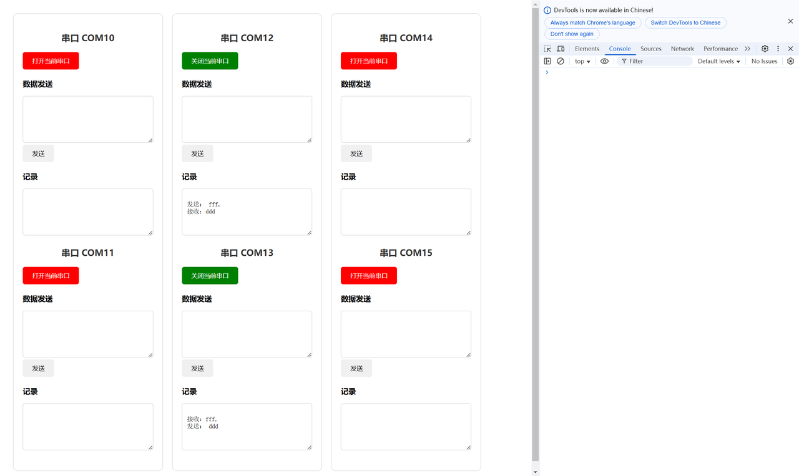

# 记录学习过程

## 3.11 pyserial基础、RESTful API

### 1. 串口通信基础

- 我首先打开了两个已经相连的串口10和11，然后使用`is_Open`函数查看是否成功打开。
- 然后，通过`write`方法可以将数据写入（要写明编码方式，我使用utf-8），也就是发送数据。
- 对于数据的接收，我这里使用`read_all`函数可以接收所有数据（解码方式同样是utf-8），结果正常输出。

### 2. Flask

#### 2.1 基础

首先用当前脚本名称实例化Flask对象，方便flask从该脚本文件中获取需要的内容。

```python
app = Flask(__name__)
```

然后使用`@app.route('路由名')`指明前端调用此函数，最后使用`app.run()`即可开启后端服务器。

#### 2.2 四种常用的钩子函数

- `Before_request`、`before_first_request`：先绑定的先执行
  - 前者在每次请求之前都会执行，后者只有第一次请求之前执行

- `after_request`、`teardown_request`：先绑定的后执行
  - 前者每一次请求之后都会调用，后者接收服务器出现的错误信息

#### 2.3 返回json数据给前端

一般使用`jsonify(data)`返回，data为需返回的json格式数据

### 3. RESTful API的使用

这里我实现了一个任务管理API，依据参考文档，我使用GET、POST、PUT、DELETE依次实现任务的增删改查。同时实现了后端flask与前端axios的交互。

#### 3.1 后端flask框架

- **获取所有任务**
  这是最基础的GET方法，不赘述
  
- **获取单个任务**
  在IP地址上，可添加后缀{id}来表示获取不同的任务id。详细写法如下：

  ```python
  @app.route('/api/tasks/<int:task_id>')
  def get_task(task_id):
  ```
  
- **创建新任务**
  这里的路由路径与获取所有任务相同，但是这里使用的是POST请求，因此，后端使用POST即可创建新任务，GET就是获取所有任务。
  
- **更新任务**
  更新任务不仅要获取id，还要给他任务的名字。这里我刚开始遇到了一个小问题：
  获取单个任务时，由于之前task_id是通过路由传递给后端，此时不需要使用get方法获取前端传递的这个参数。然而任务名字title是没有通过路由传递过来，这时候id是可以直接获取的，而title仍需要通过get方法获取参数值。

  ```python
  @app.route('/api/tasks/<int:task_id>', methods=['PUT'])
  def update_task(task_id):
      task_name = request.json.get('title')
  ```
  
- **删除任务**
  这里与前面写法差不多，不再赘述

#### 3.2 前后端交互

- 初始预置了三个任务

- 以下分别基础的增删改查结果


#### 疑问

1. 前端只能使用http而不能使用https协议
2. 后端flask需要使用CORS库允许所有来源的跨域请求
3. 将任务id这个参数送到路由路径的意义是什么？首先python自己有重载功能，其次，本任务中通过传入不同的id，函数完全自行更改对应的内容。
4. 使用DELETE、PUT的好处在哪？通过调试，我发现所有请求都可以实现发送数据，接收数据。

#### 解决

1. HTTP协议本身不加密数据传输，适用于开发和测试环境或某些对安全性要求不高的场景。如果使用https需要给SSL证书。
2. 跨源资源共享（Cross-Origin Resource Sharing, CORS）是一种基于HTTP头的机制，它允许服务器声明哪些来源的网页被允许访问其资源。
简单来说就是，浏览器不允许不同源的网页间交互。
3. 似乎是设计RESTful API的准则就是这样
4. 首先是设计原则：GET用于检索信息，POST用于创建资源，PUT用于更新资源，DELETE用于删除资源。这样的意图更加明显。其次，后者更安全，无论执行多少次同样的请求，结果都是相同的。而POST可能重复执行创建资源。

## 3.12 串口通信程序（实现前后端交互、yaml配置、git版本管理）

### 一、串口数据采集模块

#### 1. 以线程方式启动串口

前端传来需要打开的串口名，首先使用`serial.tools.list_ports.comports()`函数判断是否存在这个串口。若存在，则使用open方法打开当前串口，由于串口数据读取的特性，这里使用线程的方式去创建，方便之后进行读取数据而不影响主进程。

- 创建时，串口连接有许多参数可以设置，以下整理了一些常用的参数：
  - `Port`：串口名
  - `Baudrate`：波特率（有一些固定值，一般用115200）
  - `Bytesize`：数据位数
  - `Timeout`：读取超时值
  - `Write_timeout`：写入超时值
  - `Parity`：奇偶校验位

- 创建完成后，可以调用API，以下为常用的API调用
  - `Open()`
  - `Close()`
  - 读取数据的几种方式：
    - `Read(Size=1)`，size为读取的字节数
    - `Read_until(expected=LF, size=None)`，预期要搜索到哪个字符串，以及要读取的字节数
    - `Readall()`
    - `Readline(size=-1)`，读取串口数据的一行
  - `Write(data)`
  - `Flush()`
  - `In_waiting`，获取还在输入缓冲区的字节数
  - `Out_waiting`，获取还在输出缓冲区的字节数
  - `Is_open`，判断串口是否打开

#### 2. 关闭串口

这里使用`close()`方法即可，`serial_ports[port].close()`

#### 3. 发送数据

这里使用`write`方法写入，并指定编码方式为utf-8，
`serial_ports[port].write(data.encode('utf-8'))`

#### 4. 读取数据

读取数据暂时按照常用的循环读取的方法，不断通过`in_waiting`方法判断是否有数据需要读取，之后有机会尝试改进一下，比如信号机制等。

```python
if ser.in_waiting > 0:
    # 检查串行端口的接收缓冲区是否有可读的数据 
    data = ser.readline().decode('utf-8').strip()
```

### 二、前后端交互

前端界面的编码在此不做过多解释，较为特殊的地方在于，六个串口的界面类似，采用了for循环展示。对于各自的控件（打开串口按钮、发送数据等）采用class进行分类，使其可以展示不同的样式。

```html
<div v-for="(port, index) in ports" :key="index" class="port-pair">
  <h3>串口 {{ port[0] }}</h3>
  <button :class="{'open': portStatus[port[0]], 'closed': !portStatus[port[0]]}" @click="portStatus[port[0]] ? closePort(port[0]) : openPort(port[0])">
    {{ portStatus[port[0]] ? '关闭' : '打开' }}当前串口
  </button>
  <div class="input-group">
    <label for="send-{{ port[0] }}">数据发送</label>
    <textarea id="send-{{ port[0] }}" v-model="sendData[port[0]]"></textarea>
    <button @click="sendDataToPort(port[0])">发送</button>

    <label for="receive-{{ port[0] }}">记录</label>
    <textarea readonly id="receive-{{ port[0] }}" v-model="receiveData[port[0]]"></textarea>
  </div>
  
  <h3>串口 {{ port[1] }}</h3>
  <button :class="{'open': portStatus[port[1]], 'closed': !portStatus[port[1]]}" @click="portStatus[port[1]] ? closePort(port[1]) : openPort(port[1])">
    {{ portStatus[port[1]] ? '关闭' : '打开' }}当前串口
  </button>
  <div class="input-group">
    <label for="send-{{ port[1] }}">数据发送</label>
    <textarea id="send-{{ port[1] }}" v-model="sendData[port[1]]"></textarea>
    <button @click="sendDataToPort(port[1])">发送</button>

    <label for="receive-{{ port[1] }}">记录</label>
    <textarea readonly id="receive-{{ port[1] }}" v-model="receiveData[port[1]]"></textarea>
  </div>
</div>
```

最终实现前端可以点击发送数据，在SSCOM模拟硬件可以接收到数据。同样，SSCOM发送的数据，前端也可以正常接收。如下图：前端打开串口12，SSCOM打开串口13，可实现消息的相互传递。



### 改进点

#### 1. 加入yaml作为配置文件

新建一个文件为config.yaml，在里面填写可以自定义的数据，之后在py文件中可以读取文件来导入变量。

```python
import yaml

# 加载配置文件
with open('config.yaml', 'r') as file:
    config = yaml.safe_load(file)
```

#### 2. 创建git进行版本控制

- 以下浅浅记录一下如何将写好的代码上传到仓库
  - 首先在gitee（github）上建立一个仓库，记住仓库地址
  - 其次将本地代码使用git进行初始化并提交到本地仓库
    - `Git init`
    - `Git add .`
    - `Git commit -m '提交说明'`
  - 然后就可以将本地仓库与gitee（github）仓库进行远程连接
    - `git remote add origin xxx` （xxx为远程仓库地址）
    - `git pull --rebase origin master`（强制将远程仓库文件更新至指定远程仓库中）
    - `git push -u origin master`（将本地仓库中的文件推送至指定的远程仓库中）
  - 最后基于git，成功将代码同步到gitee上，以下为最近的提交记录。

## 3.13 前后端打包以及JWT令牌验证（解释器）

### 一、将vue前端和python脚本使用electron打包为桌面应用程序

#### 1. 打包vue

- 确保存在文件vite.config.js，用来配置打包选项。这里主要改动入口文件和出口文件即可，如下：

```javascript
  build: {
    outDir: 'dist', // 输出目录
    rollupOptions: {
      input: '/index.html', // 入口文件
    },
  },
```

- 接着使用指令`npm run build`，此时会出现一个dist文件夹。

#### 2. 打包python文件

- 使用`pyinstaller --name=serialAPI --onefile serialAPI.py`指令，可以生成一个.spec文件，这里面可以进行必要的打包配置，主要改动的为datas里面输入需要的依赖文件，hiddenimports存放需要的包。
- 通过这种方式也会生成一个dist文件夹，里面存在exe文件，尝试运行后，可以看到与直接运行py文件的效果相同。（我的exe文件大小为9MB）


#### 3. 使用electron打包

- 根目录下创建一个main.csj文件，这里是项目的主要运行部分，包括前端界面展示和后端服务器的启动。以下介绍一些详细配置：

```javascript
function createWindow() {
  // 创建浏览器窗口
  mainWindow = new BrowserWindow({
    width: 800,
    height: 600,
  })
  
  // 前端项目启动路径
  mainWindow.loadFile('dist/index.html')

  // 打开开发者工具
  mainWindow.webContents.openDevTools()
}

app.on('ready', function () {
  // 编写初始化完成后，需要创建前端窗口、启动后端程序等
  createWindow();
     
  // 启动python可执行文件
  pythonProcess = spawn(pythonExePath, [], {
    cwd: path.join(__dirname, 'dist') // 设置工作目录为dist
  })
  
  // 此后还可以编写监听python结果的一些东西...

})
```

- 配置package.json文件，首先需要安装两个包（electron-builder和electron）。此外需要进行两处更改：
  - 首先是在前面加一行`"main": "main.cjs"`，代表应用程序的入口文件为我刚刚编写的程序
  - 其次，在末尾需要添加以下信息，告诉打包程序如何查找我的源程序

```javascript

  "build": {
    "appId": "com.example.app",
    "files": [
      "dist/**/*",
      "main.cjs"
    ],
    "directories": {
      "output": "build"
    }
  }
```

- 最后一步就是使用打包指令`npm run pack`，完成后在刚刚指定的build文件夹下有一个exe文件，双击运行后结果与打包前完全相同。


### 二、JWT令牌验证

#### 1. 前置知识——装饰器

```python
def hi(name='lihua'):
    def hello():
        print(f"Hello {name}!")
    def welcome():
        print(f"Welcome {name}!")

    if name == 'lihua':
        return hello
    else:
        return welcome
```

在python中，直接使用函数名，那么这个函数可以被传递。如果在后面加上括号，那么这个函数就会被调用。

- 输入`a = hi()`，此时会执行hi函数，该函数返回hello，没有括号代表函数传递，此时返回的就是函数hello，而不会调用。
- 同样的，如果输入`hi()()`，这时候就是调用hello函数，打印Hello lihua。

```python
def decorate_name(f):
    @wraps(f)
    def decorated(*args, **kwargs):
        print(f"装饰器装饰函数 {f.__name__}")
        username = "admin"
        return f(username, *args, **kwargs)
    return decorated

@decorate_name
def register(username):
    print(f"注册用户 {username}")

register()
print(register.__name__)
```

了解上述内容后，就可以使用装饰器了。

- 这里先不看`@wraps(f)`这句话，我们在调用register函数时，他被作为参数传递给decorate_name函数，接着会调用decorated函数，该函数内部的username就会返回给被装饰函数register。即可打印出注册用户 admin。
- wraps：python的一个包，他的作用是保留被装饰函数的元信息。若不加这句话register.__name__就会返回decorated，而不是register。
- 装饰器的作用：在不改变原函数的情况下，增加新的功能。

#### 2. 身份认证

以下是一个用于实现JWT令牌验证的装饰器使用。

```python
def token_required(f):
    @wraps(f)
    def decorated(*args, **kwargs):
        token = request.headers['Authorization']
            
        try:
            # 解码token
            data = jwt.decode(token, app.config['SECRET_KEY'], algorithms=["HS256"])
            current_user = users_db.get(data['username'])
            if not current_user:
                return jsonify({'message': '用户不存在'}), 401
        except jwt.ExpiredSignatureError:
            return jsonify({'message': '令牌已过期'}), 401
        except jwt.InvalidTokenError:
            return jsonify({'message': '无效的令牌'}), 401
            
        # 将当前用户信息传递给被装饰的函数
        return f(current_user, *args, **kwargs)
    
    return decorated
```

我们在返回用户相关信息，或者只有特定用户才能查看的信息的时候，在该函数前加一句`@token_required`。此时装饰器会验证该用户是否合法，只有合法的用户才会将用户名传递给被装饰函数。

#### 3. 编码、解码

- JWT编码

token由以下三部分编码形成：payload包含用户名等信息，SECRET_KEY为密钥，最后是编码算法。

```python
token = jwt.encode(payload , SECRET_KEY, algorithms=["HS256"])
```

- JWT解码

```python
payload = jwt.decode(token, SECRET_KEY, algorithms=["HS256"])
```

#### 4. 小知识

```python
app.config['SECRET_KEY'] = os.environ.get('SECRET_KEY', 'your-secret-key')
```

## 3.14 Modbus

### 一、Modbus协议

帧结构：地址+功能码（03查询、06修改）+数据+校验位

#### 1. 查询功能码（0x03）

主机发送：`01 03 00 00 00 01 84 0A`

- 01为从机的地址
- 03代表查询功能
- 从寄存器0000开始，查询0001个寄存器，这里代表只查询0000这一个寄存器
- 最后是数据校验位

从机回复：`01 03 02 19 98 B2 7E`

- 01为从机的地址
- 03代表查询功能
- 02代表需要回复的字节数，长度为2 * 寄存器数量（字节）
- 19 98为寄存器的值
- 最后是数据校验位

#### 2. 修改功能码（0x06）

`01 06 00 00 00 01 48 0A`（主从机内容相同）

- 01为从机的地址
- 06代表修改功能
- 00 00代表修改的寄存器
- 00 01代表修改的值
- 最后是数据校验位

#### 3. 批量修改功能码（0x10）

主机：`01 10 00 00 00 02 04 19 98 46 62 65 57 87 54 XX XX`
从机除去字节数和具体字节：`01 10 00 00 00 02 04 YY YY`

### 二、Flask蓝图

Flask 的蓝图（Blueprints）是一种组织代码的机制，允许将 Flask 应用分解成多个模块。这样可以更好地组织应用逻辑，使得应用更具可维护性和可扩展性。

#### 1. 项目结构

```java
API/
├── app.py
├── modbus/
│   ├── __init__.py
│   └── routes.py
└── serial/
    ├── __init__.py
    └── routes.py
```

#### 2. 定义蓝图

```python
modbus_bp = Blueprint('modbus', __name__)
@modbus_bp.route('/send', methods=['POST'])
def send_modbus_frame():    
```

#### 3. 注册蓝图

```python
from modbus.routes import modbus_bp
app.register_blueprint(modbus_bp, url_prefix='/modbus')
```

### 三、基于 Modbus 和Serial结合使用
1. 项目流程
- 总结日志管理
  - 大致流程是main文件写了一个自定义的logging.config.dictConfig方法来设置复杂的日志配置（因为这里需要按条件（如日期）滚动日志文件），其他文件logger = logging.getLogger(__name__)，即可调用logger进行info、error等的上传（最终合在主程序定义的文件内）
  - 结果是按天按小时按串口按信息分log
- 缓冲队列
  - 为串口创建一个SerialHandler处理类，定义了收发缓冲队列以及收发线程，也就是每个串口有自己的数据存储，更方便管理。每启动一个串口对应两个线程，在各自的线程内通过self.queue可以调用自己的缓冲队列。
  - 创建一个SerialManager管理类，存储各个 {串口名：串口处理类} 的字典，可根据串口名返回对应的串口处理类，方便后续对各自串口的数据进行读写。
  - 将modbus帧的发送和接收采用缓冲队列存储，队列的每个大小为一个字节，解析时严格按照modbus协议进行读写。为了保证接收队列的长度不能过长，需要隔段时间进行数据帧丢弃。由于接收串口数据回应的线程不能停，他会持续占有接收线程导致丢弃数据与他产生死锁。（这一块还不知道为什么死锁，需要反复斟酌一下）
- TCP协议
  - 基于socket库，创建TCP连接，服务器始终监听预设的ip和端口号，为每一个连接的客户端创建一个进程进行管理
  - 处理客户端请求：客户端会将json格式的内容发送过来，主要解析的还是send和receive指令

2. 遇到的问题：
- 使用串口服务的时候，每一个串口对应了很多个从机，刚开始为了让请求快速发送，将每一个发送请求都建立一个线程实现高并发。但项目使用的modbus485仅支持半双工通信且静默期太短导致设备认为两次请求是同一次发送的。因此采用每个串口设置自己的缓冲队列对发送请求和接收请求进行存储，然后不断的入队出队
- modbus协议返回数据帧时是按字节进行发送的，当接收队列的请求过于频繁的时候会导致同一段数据帧分两次接收。因此采用按字节存储的缓冲队列，并按照modbus协议进行逐字节解析。这也是我刚开始纳闷为什么modbus协议要明确数据帧的长度。
- 若接收队列长时间没有清理会导致内存被持续占用，因此需要定期删除队列的数据帧。这里有一个很大的问题是，为了遵循modbus协议，不能直接删除指定字节长度的内容，还是需要解析数据帧。然后又遇到了一个问题，清理数据帧和接收数据帧请求都需要占用缓冲队列（产生死锁，具体原因不明），因此采用双缓冲队列，一个负责接收数据帧，一个负责处理数据帧（解决办法也就那样，到时候不说吧）
- 由于TCP网络请求不稳定，内网穿透延迟也会导致频繁请求会出现两次json内容连在一起，这里采用json解析

3. 一段话总结本次项目
在串口服务器的项目中，我主要负责设计和实现一个综合性的系统，涵盖日志管理、串口数据处理以及TCP网络通信。首先，在日志管理方面，我们通过定制的日志配置方法实现了按条件滚动存储日志文件的功能，确保了日志信息的有效管理（分时间、分类别）。接着，在串口数据处理部分，我们为每个串口创建了独立的数据缓冲队列和处理线程，有效地解决了高并发请求和Modbus协议下数据帧解析的问题。同时，引入了双缓冲队列机制避免了接收和清理数据时可能出现的死锁问题。最后，在TCP网络通信模块，我们基于socket库建立了稳定的服务器端，能够有效处理客户端发送的JSON格式请求，并解决了由于网络延迟导致的数据粘连问题。
